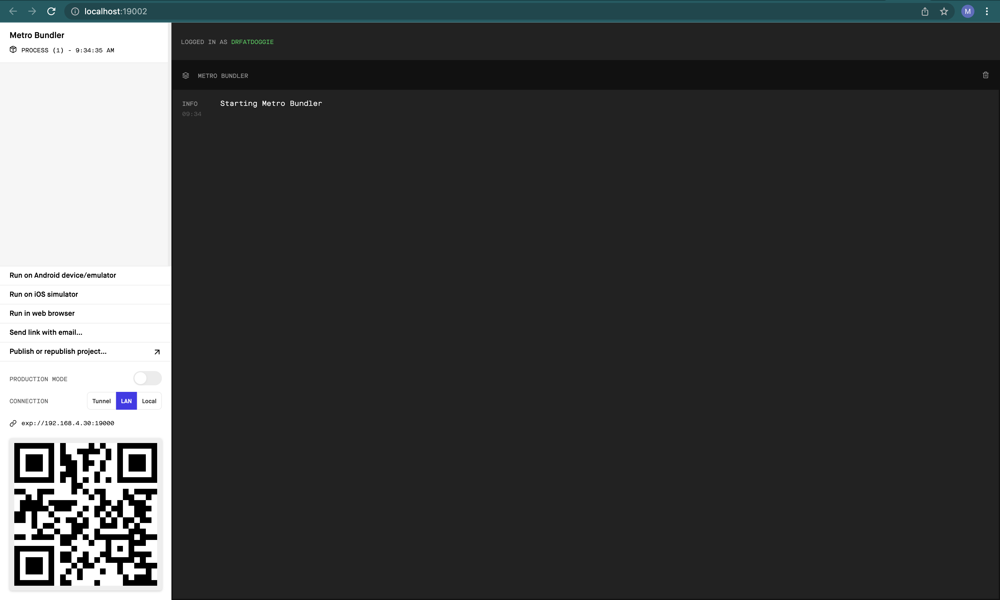
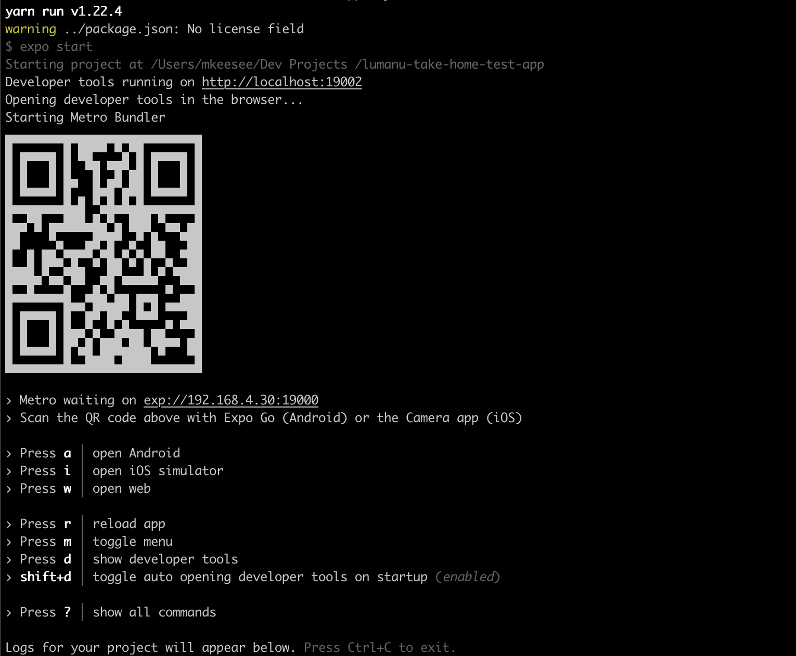

## ✨ Overview

Dr. Watch Doggie's Library Monitor is a web and mobile friendly application, created by me, Dr. Fat Doggie. The app allows users to keep track of the most recent date/version associated with various GitHub repos, so you can keep your dependencies up to date. 

In this app, you can:
1. add a GitHub repo you'd like Dr. Watch Doggie to keep track of
2. see the latest release info on your repos - including latest release date, latest release version, and release notes
3. mark a release as seen, so you know which releases you've already looked at
4. see which repos have new releases since you last looked at them

## 📦 Environment setup

### Set up Expo
- You can find official setup instructions for expo [here](https://docs.expo.dev/get-started/installation/). For this app, the below step should be sufficient
- Run: `npm install --global expo-cli`

### Set up Yarn
- While you can install yarn via direct shell install, it is easier to manage multiple versions with node using nvm and npm
- Run: `npm install --global yarn` OR `curl -o- -L https://yarnpkg.com/install.sh | bash -s -- --version [version]`

### Set up Expo for mobile devices
- If you do not have a mobile environment set up with device simulators on your machine (via Xcode or Android Studio), you can still see this app live on a device! Just download the Expo App on your chosen device and follow the run instructions below. You can also run in your browser, no device required.
- Expo download link: https://expo.dev/client 

## 🏃‍♀️Running the App
1. Run: `yarn` || `yarn install`
2. Run: `yarn start`
3. You will likely see directions for running the app in two places. 
- The browser: window will pop up with options to run the app on a simulator or via browser, as well as a QR code to run directly on a mobile device

- The terminal: your terminal will show similar information, with commands for running on a simulator or the browser, and a QR code to run on mobile device

## 🧪 Running Test Suite

## 🐞 Known Bugs
- Color of repo card does not change as expected when marked as seen or when a new release has been found
- Async storage does not populate saved repos on web

## 😱 Common Problems